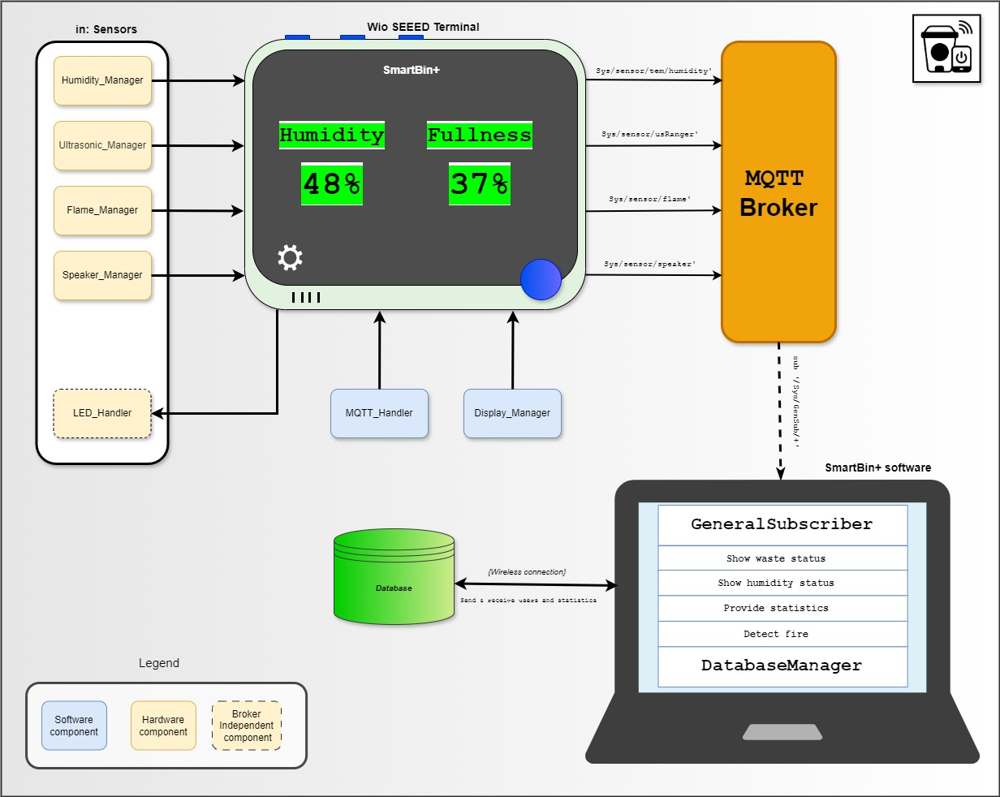

# SmartBin+

## Description

**SmartBin+ is an intelligent waste monitor and control system designed to optimize waste management in fast food restaurants. Reliable container fullness and humidity monitor, configurable location, prompt notification feature and fire detection capabilities: all-in-one!**

Are you prepared to transform the way your restaurant handles waste? With nothing less than a set of precise sensors and a high quality desktop application, you will gain insights into your disposal stations' organization, keeping you informed about all container statuses. Within the application, you will not only have access to the current level of fullness of the bins, but also the humidity degrees which allow you to judge when the garbage needs to be removed. Of course, the bin system could not be classified as a SmartBin+ unless we carefully implement a notification feature that will help to rationalize waste management. Furthermore, our system enhances the quality of restaurant service by utilizing display status indicators and LED lights, benefiting both garbage collectors and restaurant clients. Last but not least, the system will help to ensure fire safety by alarming you in case of a presence of flame in the container!

## Project Background

In the dynamic environment of restaurant operations, efficient waste management is paramount. Traditionally, this process relies heavily on manual oversight, leading to inefficiencies and potential oversights.

Our solution addresses this challenge by integrating precise sensors and a sophisticated desktop application. By leveraging real-time data, restaurant managers gain insights into waste disposal station organization and bin statuses. This enables proactive waste management strategies, with access to current fill levels and humidity data for informed decision-making.

Furthermore, our system incorporates intelligent notification features, ensuring timely alerts for critical capacity levels and waste removal schedules. Visual indicators and LED lights enhance communication between staff, improving operational efficiency and customer experience.

With built-in fire detection capabilities, safety is prioritized, providing immediate alerts in case of emergencies.

In summary, our solution offers a data-driven approach to waste management in restaurants, streamlining operations and ensuring compliance with safety standards.

## Components you need in order to use SmartBin+

1.  [Wio Seeed Terminal](https://www.seeedstudio.com/Wio-Terminal-p-4509.html)
2.  [Arduino IDE](https://www.arduino.cc/en/software)
3.  Arduino libraries:

    - [Adafruit NeoPixel](https://github.com/adafruit/Adafruit_NeoPixel), by Phil "Paint Your Dragon" Burgess for Adafruit Industries
    - [Adafruit Unified Sensor](https://github.com/adafruit/Adafruit_Sensor), by Adafruit Industries
    - [DHT sensor library](https://github.com/adafruit/DHT-sensor-library), by Adafruit Industries
    - [PubSubClient](https://pubsubclient.knolleary.net/), by Nick O'Leary
    - [Seeed_Arduino_FS](https://github.com/Seeed-Studio/Seeed_Arduino_FS), by Seeed Studio -[Seeed_Arduino_RTC](https://github.com/Seeed-Studio/Seeed_Arduino_RTC), by Seeed Studio
    - [Seeed_Arduino_SFUD](https://github.com/Seeed-Studio/Seeed_Arduino_SFUD), by Seeed Studio
    - [Seeed_Arduino_rpcUnified](https://github.com/Seeed-Studio/Seeed_Arduino_rpcUnified), by Seeed Studio
    - [Seeed_Arduino_rpcWiFi](https://github.com/Seeed-Studio/Seeed_Arduino_rpcWiFi), by Seeed Studio
    - [Seeed_Arduino_mbedtls](https://github.com/Seeed-Studio/Seeed_Arduino_mbedtls), by Seeed Studio
    - [Ultrasonic](https://github.com/ErickSimoes/Ultrasonic), by Erick Simoes

4.  Wio Terminal Grove Sensors:

    - Grove - Ultrasonic Ranger
    - Grove - Temperature & Humidity Sensor
    - Grove - Flame Sensor
    - Grove - Speaker Actuator
    - Grove - RGB stick / Red LED light

5.  [Git](https://git-scm.com/downloads) installed in order to clone the repository

6.  [Java JDK](https://www.oracle.com/se/java/technologies/downloads/) and [JavaFX](https://openjfx.io/openjfx-docs/#install-java)

## Installation Process

### Hardware Setup

#### Arduino Wio Terminal

Ensure you have the Wio Terminal, an Arduino compatible microcontroller, ready for use.

#### Sensor Integration

Connect the sensors to the Wio Terminal following the pin-out instructions:

- For the Ultrasonic Ranger sensor:

  - SIG connected to 18 (which is D3) on the Wio
  - GND can be connected to any GND port, VCC connected to either 2/4 (5V)

- For the Humidity & Temperature sensor:

  - SIG connected to 16 (which is D2) on the Wio
  - GND can be connected to any GND port, VCC connected to either 2/4 (both 5V)

- For the RGB LED bar:

  - SIG connected to 5 (which is l2c1_SCL) on the Wio grove port 1
  - GND can be connected GND port in Grove port 1, VCC connected to 3v3 on Grove port 1

- For the Speaker Actuator:

  - SIG connected to 13 (which is D0) on the Wio Grove port 2
  - GND can be connected to any GND port in Grove port 2, VCC connected to 3v3 on Grove port 2

- For the Flame Sensor:

  - SIG connected to - (which is -) on the Wio
  - GND can be connected to any GND port, VCC connected to -

### Software Setup

#### Arduino IDE

1. Open the Arduino IDE and navigate to Tools > Manage Libraries...
2. Install the required libraries by searching for the library name in the search bar in 'library' tab and clicking on the Install button.
   (Note: It is recommended to download the latest version of each library)

#### Code Integration

1. Download our project repository and locate the Terminal.ino file containing the main code.
2. Within the repository, you'll find two directories `Terminal` and `Application`, which are the directories for handling the Arduino Wio Terminal and the SmartBin+ desktop software respectively.
3. Ensure to include the Secrets.h file with your WiFi credentials.
4. Upload the Terminal.ino file to your Wio Terminal using the Arduino IDE.

## Used Technologies

- GIT (GITLAB & GIT BASH)
- C++
- Java / JavaFX
- INTELLIJ IDE
- FIGMA
- GOOGLE DOCS
- TINKERCAD
- MIRO
- DRAW.IO
- WIO SEEED TERMINAL
- ULTRASONIC SENSOR
- HUMIDITY AND TEMPERATURE SENSOR
- FLAME SENSOR
- SPEAKER ACTUATOR
- RGB LED STICK

## Use Case Diagram

.png>)

## UML Class Diagram

.jpg>)

## System Architecture

## Authors and acknowledgment

Software Engineering and Management / DIT113 V24 Mini Project: System Development

Developer Group 11

- Andre Ibrahim (gusibraan@student.gu.se)
- Maksym Matsuhyria (gusmaksyma@student.gu.se)
- Gulbadanbegim Muzaffarova (gusmuzgu@student.gu.se)
- Yaroslav Ursul (gusursya@student.gu.se)
- Victoria Yurevich (gusyurevi@student.gu.se)

## License

Copyright 2024 Developer Group 11
Licensed under the Apache License, Version 2.0 (the "License");

LIABILITY, WHETHER IN AN ACTION OF CONTRACT, TORT OR OTHERWISE, ARISING FROM,
OUT OF OR IN CONNECTION WITH THE SOFTWARE OR THE USE OR OTHER DEALINGS IN THE
SOFTWARE.

See [Licence](https://git.chalmers.se/courses/dit113/2024/group-11/smartbin/-/blob/main/License.md?ref_type=heads) for full specification.
